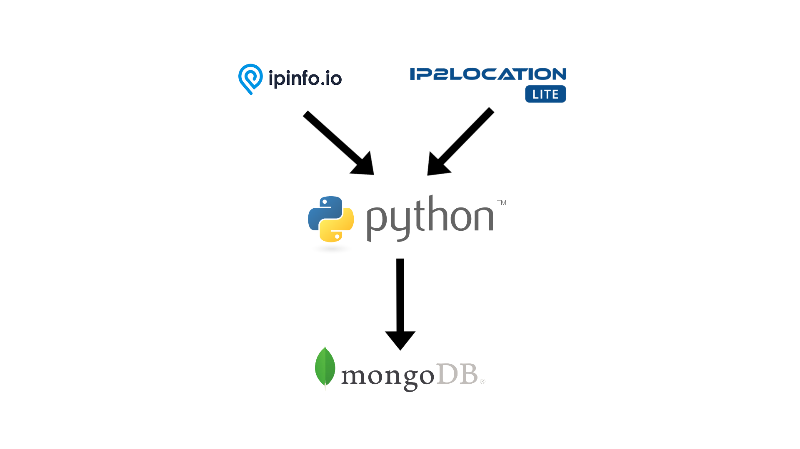

# Find location and range of IP

This program can connect to the [IPinfo](https://ipinfo.io/) API and take [IP2Location LITE IP-COUNTRY database](https://lite.ip2location.com/database/ip-country)
then parse each IP of database to IP from and IP to (range IP), IP from long, IP to long, CIDR of IP, country code,
country name, region, latitude, longitude, zipcode, and timezone. At last the result will store in MongoDB.

